# Data Flow & System Diagrams — FarmPro

**Version**: 1.0  
**Date**: 2026-06-12

All diagrams use [Mermaid](https://mermaid.js.org/) syntax. They render natively in GitHub, GitLab, VS Code (with Mermaid extension), and Notion.

---

## 1. System Architecture

High-level view of all containers and communication paths.

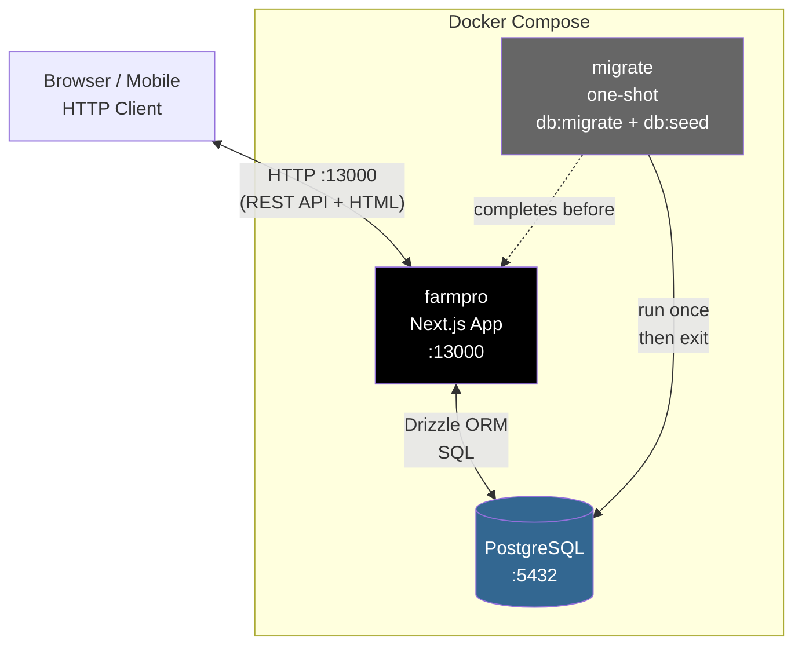

---

## 2. Application Layers

Internal structure of the Next.js application.

```mermaid
graph TB
    subgraph Browser
        UI[React Components\ncomponents/pages/]
        STORE[Zustand Store\nlib/store.ts]
    end

    subgraph NextJS["Next.js Server"]
        ROUTES[API Route Handlers\napp/api/]
        AUTH[Auth Middleware\nlib/auth.ts]
        DRIZZLE[Drizzle ORM\ndb/index.ts + schema.ts]
    end

    DB[(PostgreSQL)]

    UI -->|"reads state"| STORE
    UI -->|"calls actions"| STORE
    STORE -->|"fetch()"| ROUTES
    ROUTES -->|requireSession()| AUTH
    AUTH -->|sessions table| DB
    ROUTES -->|db.select/insert/update/delete| DRIZZLE
    DRIZZLE -->|SQL| DB
    STORE -->|"optimistic state update"| UI
```

---

## 3. User Authentication Flow

Covers all three user types: owner, employee, customer.

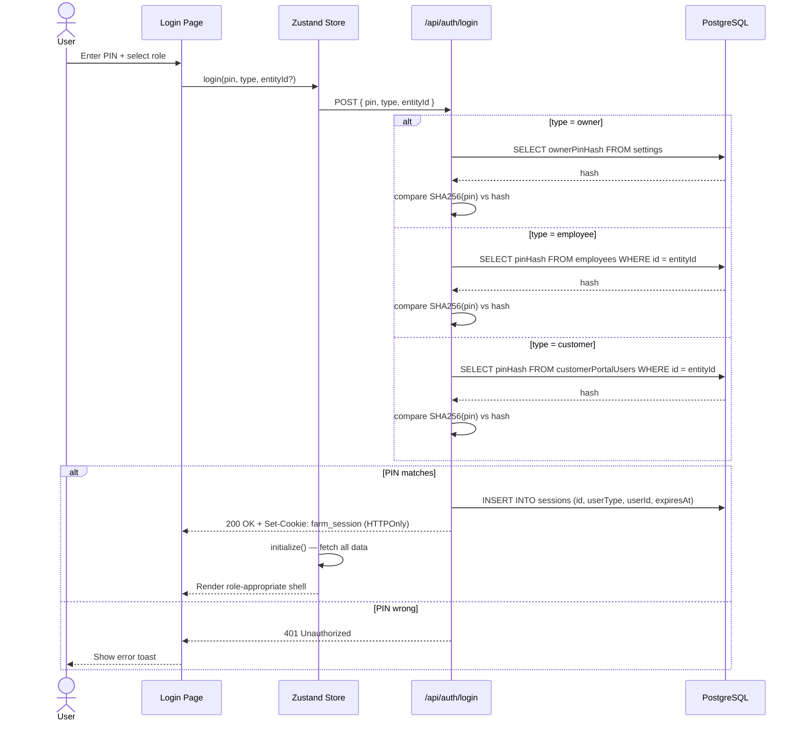

---

## 4. Store Initialization Flow

What happens when the app loads and a session is found.

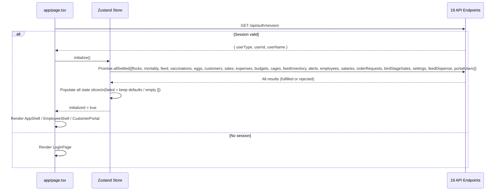

---

## 5. Flock Lifecycle State Machine

A flock moves through these stages in order. Moving backwards is not permitted.

```mermaid
stateDiagram-v2
    [*] --> Brooder : addFlock()

    Brooder --> Grower : Advance stage
    Grower --> Layer : Advance stage
    Layer --> Disposal : Advance stage
    Disposal --> Sold : Advance stage

    Brooder --> [*] : deleteFlock()
    Grower --> [*] : deleteFlock()
    Layer --> [*] : deleteFlock()
    Disposal --> [*] : deleteFlock()
    Sold --> [*] : deleteFlock()

    note right of Brooder : 0–6 weeks\nFeed: Starter
    note right of Grower : 6–16 weeks\nFeed: Grower
    note right of Layer : 16+ weeks\nFeed: Layer\nEgg production begins
    note right of Disposal : Preparing for culling\nFeed: Layer/Finisher
    note right of Sold : Birds sold\nFlock closed
```

---

## 6. flock.currentCount Data Flow

Shows every event that reads or writes the bird count.

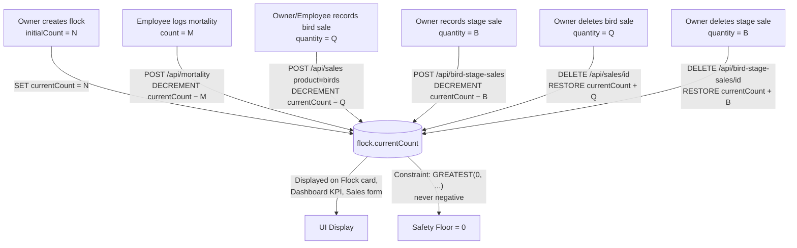

---

## 7. Feed Inventory Data Flow

Shows all reads and writes to feedInventory.currentStockKg.

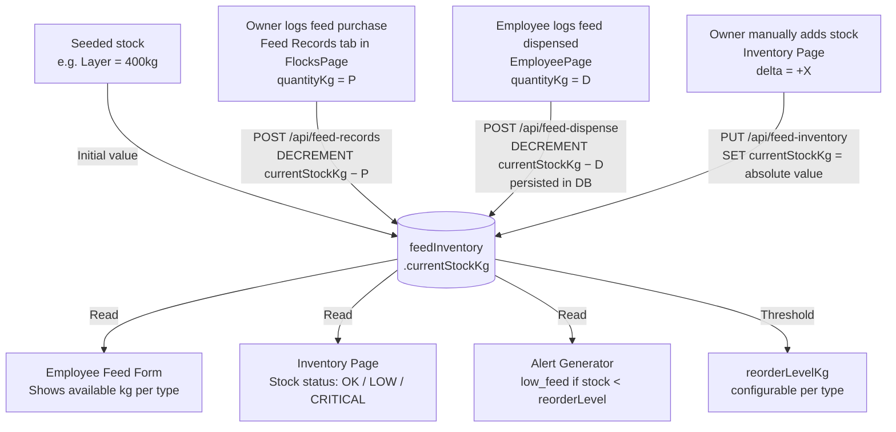

---

## 8. Egg Collection to Sale Flow

Traces an egg from collection to sold, including availability calculation.

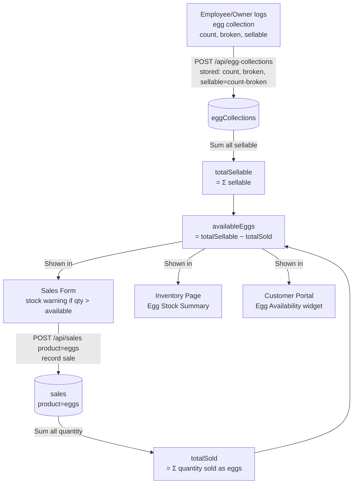

---

## 9. Sales Deletion Workflow

Two-step deletion for employees; direct deletion for owners.

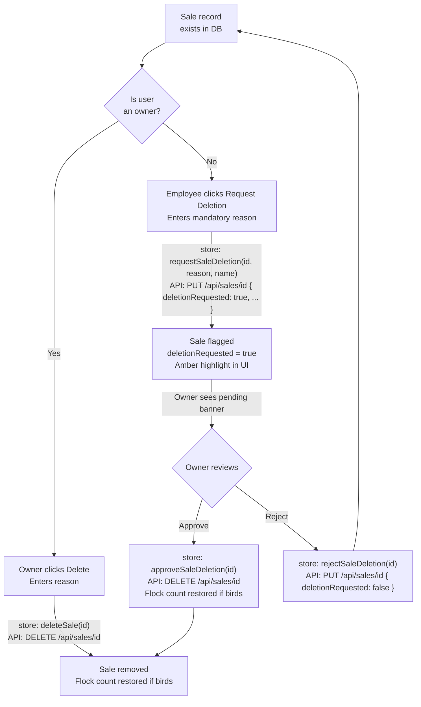

---

## 10. Revenue Calculation Flow

Shows how all revenue streams combine without double-counting.

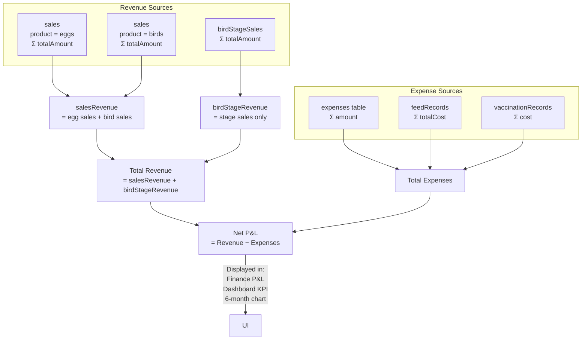

---

## 11. Order Request Lifecycle (Customer Portal)

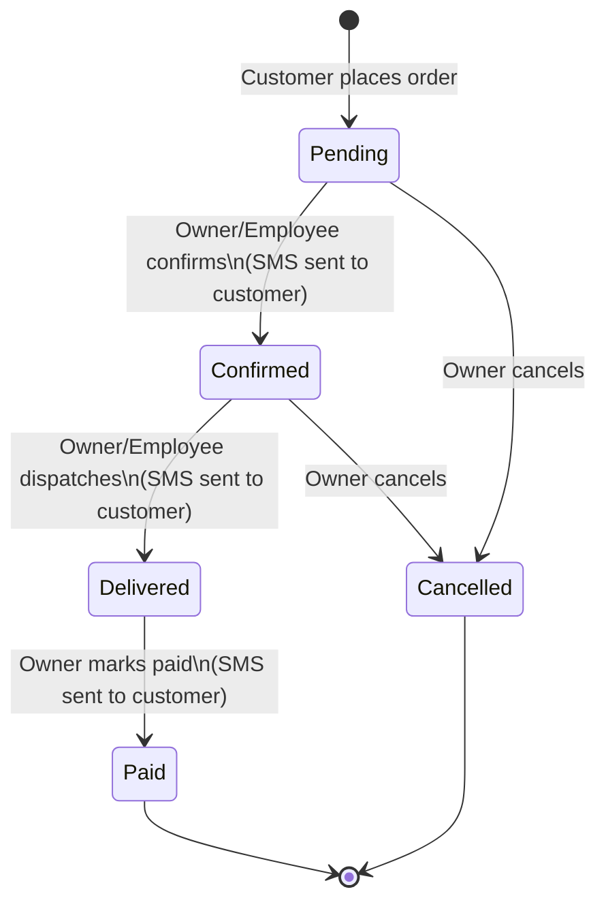

---

## 12. Complete Entity Relationship Diagram

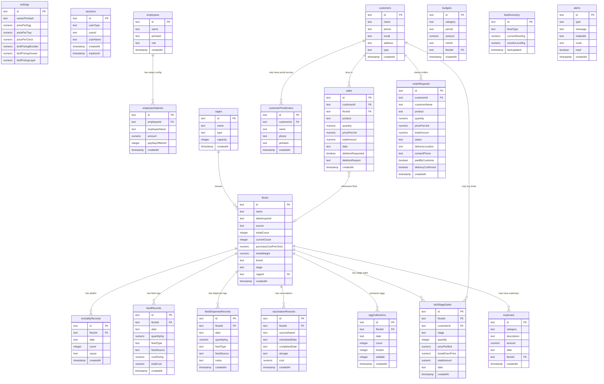

---

## 13. API Request/Response Flow (Single Operation)

Example: employee logs feed dispensed to a flock.

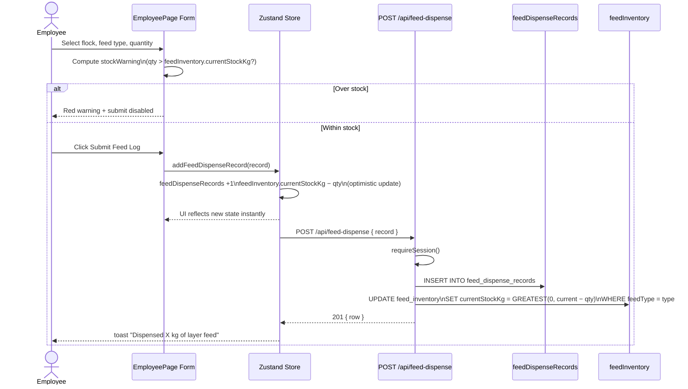
